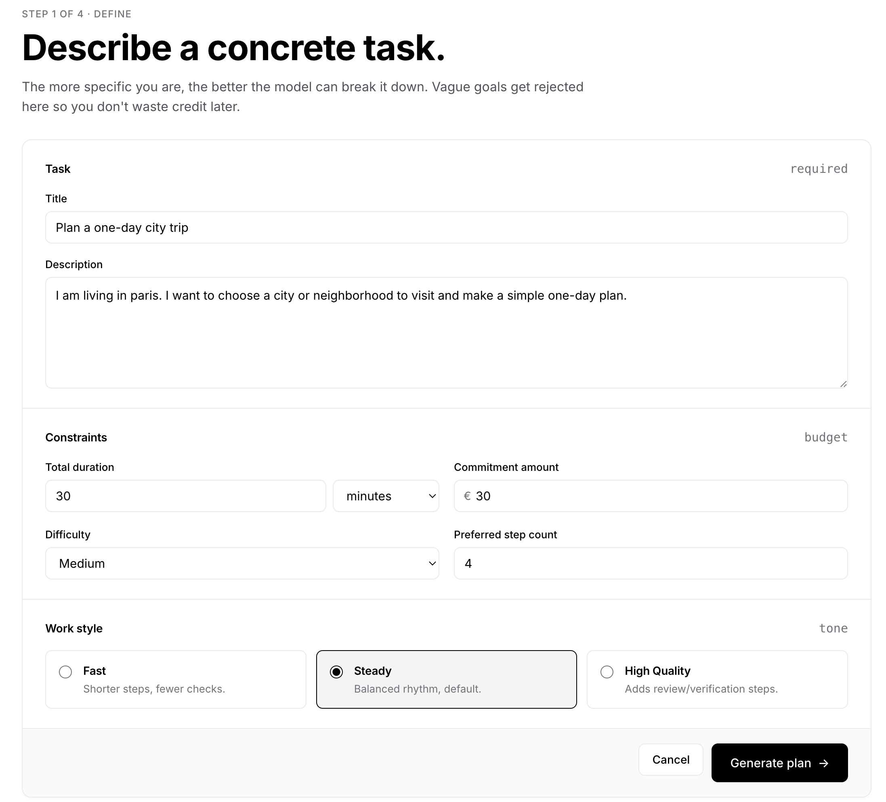
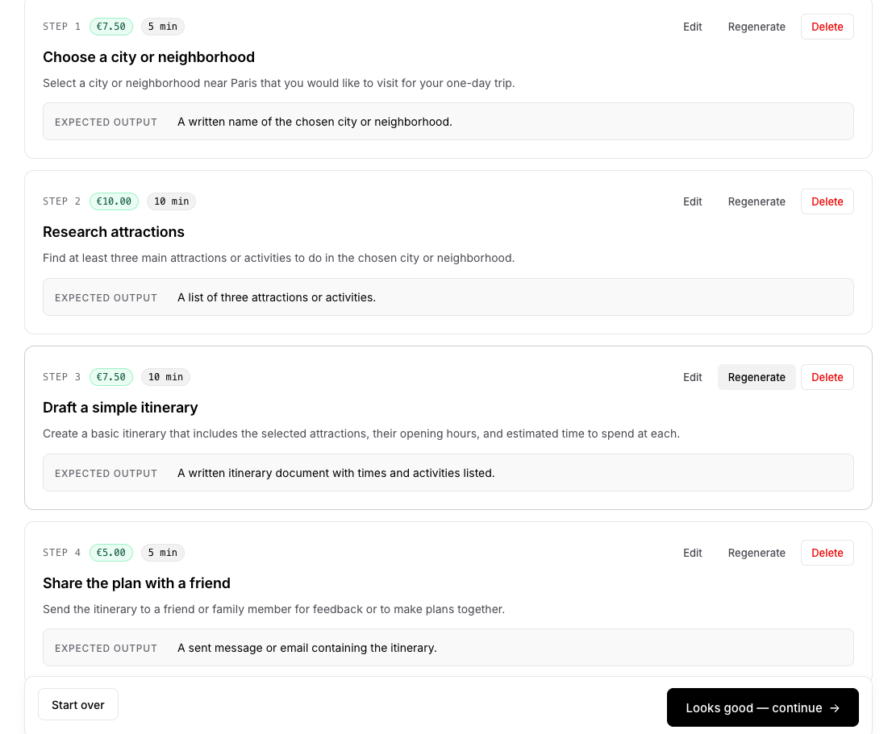
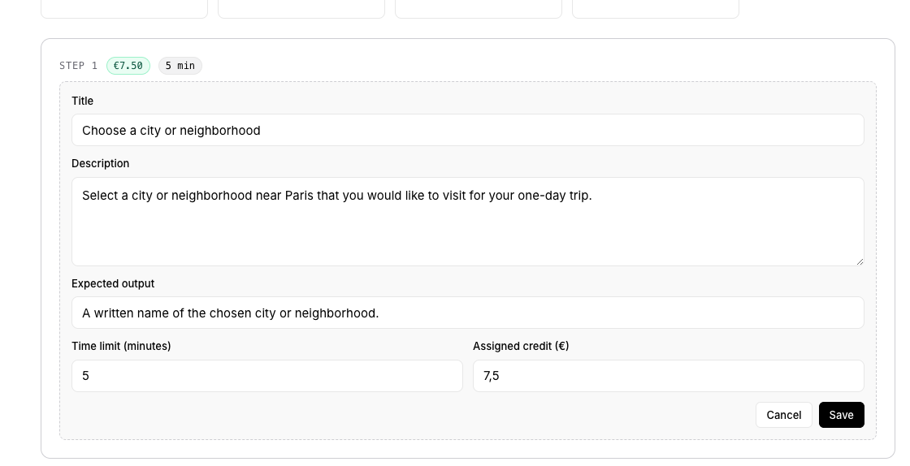
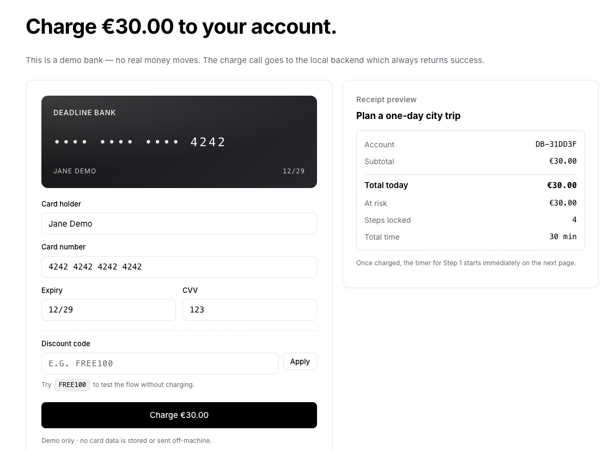
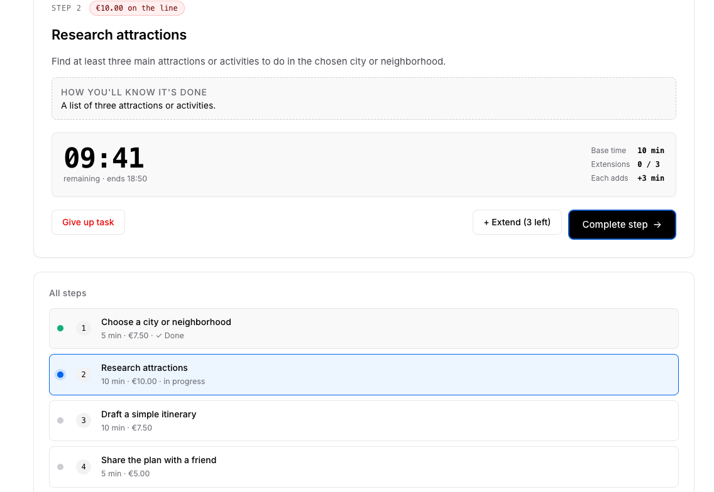
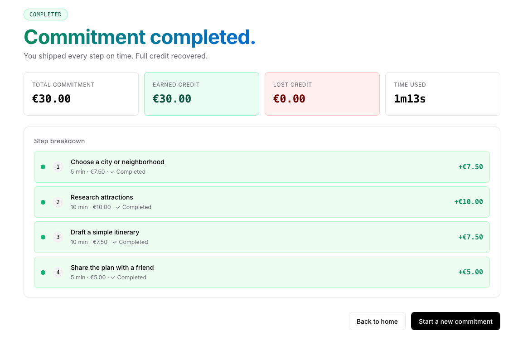

# Anti-Procrastination · Deadline Bank

Hackathon demo of an "Anti-Procrastination Commitment System" — a tool that
turns a vague goal into a credit-backed contract: AI splits the task into
verifiable steps, each step has a hard timer, and missed deadlines forfeit
the remaining money.

## How It Works

### 1. Describe the task

The user creates a commitment by entering a task title, a short description, the total time they want to spend, and the number of credits they want to stake.



### 2. Split the task into smaller steps

The system breaks the main task into 3 to 8 smaller steps.

The goal is to reduce the psychological barrier of starting a large task.



### 3. Edit, regenerate, and balance

Before starting, the user can review the generated plan.

They can:

- edit a step
- regenerate the plan
- adjust the credit distribution
- rebalance the steps so the total credits match the original commitment



### 4. Lock and execute the contract

Once the user confirms the plan, they enter a mock bank card to simulate a financial commitment. The contract is then locked, and each step must be completed through a focused timer session. Completed steps recover their credits, while failed or skipped steps lose their credits permanently.



### 5. Complete each step in order

Once the contract is locked, the user completes the generated steps one by one. Each step has its own timer and credit value, and the next step is unlocked only after the current one is completed. The user can use up to three extensions per step.
Completed steps recover credits; failed or skipped steps lose their credits permanently.



### 6.Recover credits or lose unfinished commitments

Once all subtasks are completed, the user receives the refundable credits back. If the user abandons the contract halfway, only completed subtasks are refunded, while credits assigned to unfinished subtasks are permanently lost.



## Stack

- **Frontend**: Angular 21 (standalone components, signals, lazy routes), Vercel-style design system, persistent state in `localStorage`.
- **Backend**: FastAPI + OpenAI (`gpt-4o-mini` by default). Stateless. Two endpoints for the LLM and a mock bank charge.

## Quick start

### 1. Backend

```bash
cd backend
uv sync
cp .env.example .env.local        # add OPENAI_API_KEY=sk-...
uv run uvicorn app.main:app --reload
```

API docs at <http://localhost:8000/docs>.

### 2. Frontend

```bash
cd frontend
npm install
npm start
```

Open <http://localhost:4200>.

## Experience flow

| #   | Page    | Route      | Purpose                                                                           |
| --- | ------- | ---------- | --------------------------------------------------------------------------------- |
| 1   | Home    | `/`        | Vercel-style hero introducing the contract idea.                                  |
| 2   | Create  | `/create`  | Concrete task input form (title, description, time, amount, style).               |
| 3   | Review  | `/review`  | LLM-generated steps. Edit any step, regenerate one, delete, auto-balance credits. |
| 4   | Confirm | `/confirm` | Spell out the rules: complete = recover, miss a step = forfeit cascade.           |
| 5   | Bank    | `/bank`    | Mock card-charge UI. Hits `POST /api/v1/payments/charge`.                         |
| 6   | Execute | `/execute` | Live timer, +Extend (3 × 30%), Complete step, Give up.                            |
| 7   | Result  | `/result`  | Success or failure breakdown with per-step credit outcome.                        |

## Backend endpoints

- `POST /api/v1/plan/generate` — generate the initial multi-step plan (calls OpenAI).
- `POST /api/v1/plan/regenerate-step` — rewrite a single step in place (calls OpenAI).
- `POST /api/v1/payments/charge` — mock bank charge (always succeeds after a short delay).
- `GET  /health` — liveness probe.

No database, no auth, no scheduler. Plan/contract state lives in the browser
under `localStorage["antiproc.commitments.v1"]`.

## Forfeit rules (failure cascade)

If a step times out (or the user gives up):

- Already-completed steps **keep** their credit.
- The current step + **all later steps** are forfeited.

Example with €30 split as €6 / €8 / €8 / €8 across 4 steps, failing on step 3:

| Step | Credit | Status      | Outcome |
| ---- | -----: | ----------- | ------- |
| 1    |     €6 | Completed   | kept    |
| 2    |     €8 | Completed   | kept    |
| 3    |     €8 | Failed      | forfeit |
| 4    |     €8 | Not started | forfeit |

`Earned = €14`, `Lost = €16`.

## Extension rule

Each step can be extended at most **3 times before the deadline**. Each
extension adds **30% of the original time budget**. So a 30-minute step can
stretch to a maximum of `30 + 3 × 9 = 57` minutes.
